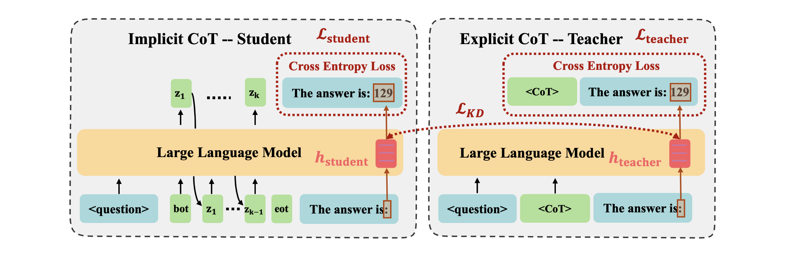

# CODI

This is the official implementation of the paper: [CODI: Compressing Chain-of-Thought into Continuous Space via Self-Distillation](https://arxiv.org/abs/2502.21074)



## Setup

**Clone the Repository**:
```
git clone git@github.com:zhenyi4/CODI.git
cd CODI
```

**Environment Setup**:
```
conda create --name codi python=3.12
conda activate codi
pip install -r requirements.txt
```

## Running the Results

Pretrained model weights are available at https://huggingface.co/zen-E, including:
* zen-E/CODI-gpt2
* zen-E/CODI-llama3.2-1b-Instruct
 
To evaluate accuracy on GSM8K, run:
```
bash script/test_gpt2.sh # or script/test_llama1b.sh
```
You can change the data_name argument to "svamp", "gsm-hard", or "multi-arith" to evaluate on out-of-distribution (OOD) mathematical benchmarks. 

## Interpret Latent Thoughts (for Section 5 in the Paper)

To probe and visualize latent thoughts on GSM8K, run:
```
bash script/probe_latent_token.sh
```
The output file will be saved in outputs/.

## Training
**GSM8k-Aug**
```
bash script/train_gpt2_gsm8k-aug.sh # or train_llama1b_gsm8k-aug.sh
```

**GSM8k-Aug-NL**
```
bash script/train_gpt2_gsm8k-aug-nl.sh
```

**Commonsense**
```
bash train_gpt2_commonsense.sh # or train_llama_commonsense.sh
```
You can change the testing script's data_name to "commonsense" for evaluation.

## Key Arguments
* `use_prj`: Whether use a projection layer for the last layer hidden state.

* `prj_dim`: The dimension of the hidden state of the projection layer.

* `prj_no_ln`: Whether the projection layer is not followed by a LayerNorm layer.

* `distill_loss_div_std`: Whether divide the distillation loss via the standard deviation of the teacher's hidden states.

* `distill_loss_type`: The type of loss used for distillation (e.g. l1, l2, smoothl1).

* `distill_loss_factor`: The multiplier that scales the distillation loss in the total loss calculation.

* `ref_loss_factor`: The multiplier that scales the teacher's cross entropy loss in the total loss calculation.

* `num_latent`: The number of latent thoughts used for training.

* `inf_latent_iterations`: The number of latent thoughts used for inference.

* `include_last_cot`: Include the last CoT step in the training data.

* `fix_attn_mask`: Flag to fix a known attention mask bug (leave as False by default).

* `max_token_num`: Discards training samples that exceed this token length threshold.

## Citation
If you use this code base in your research, please cite our paper with the following BibTex entry:
```bibtex
@article{shen2025codi,
      title={CODI: Compressing Chain-of-Thought into Continuous Space via Self-Distillation}, 
      author={Zhenyi Shen and Hanqi Yan and Linhai Zhang and Zhanghao Hu and Yali Du and Yulan He},
      year={2025},
      journal={arXiv preprint arxiv:2502.21074},
}
```
